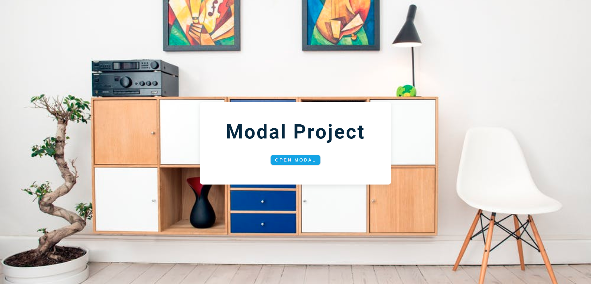
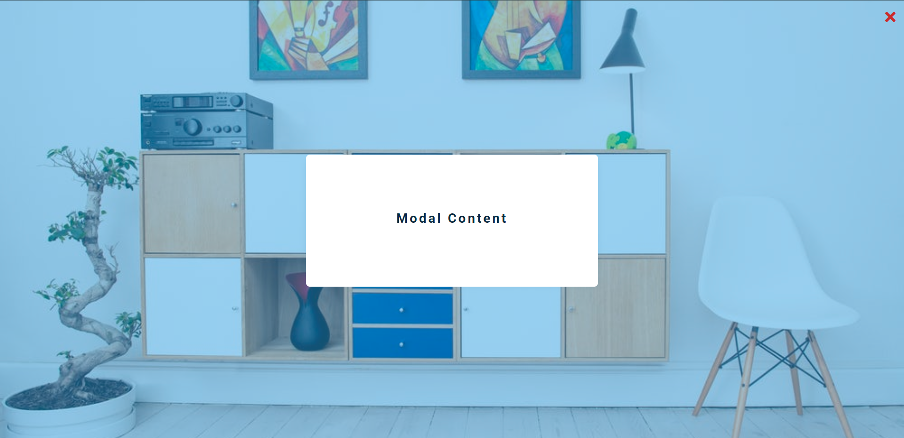

## Modal JavaScript Project:

> This is like a banner in the center, where it has some content, title and a button.

> The moment user **clicks** the **button**, there will be an **overlay** and some modal content.

> There is also an **button** to **close** the model.

